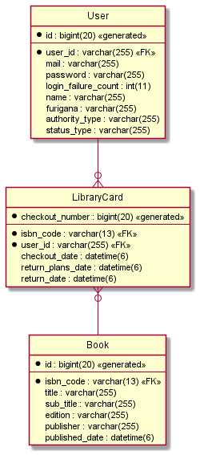

# PlantUML

PlantUMLはUML[^1] 作成をサポートするツール。

## Install

**Environment**

* Windows 10

**Requirements**

* Java
* VS Code
	- PlantUML (Extensions)

> ※ Graphvizは無くても動くぞ？

## Sample

**ER図**

* Browse the [Source code](./erd/library-system_erd.pu)

## Tips

**公式サイト**

* https://plantuml.com/ja/

---

[^1]: UMLはUnified Modeling Language (統一モデリング言語) の略。
